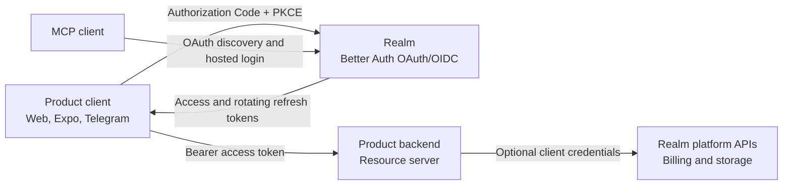

# Auth SDK v1 Design

Status: implementation in progress, canonical working document  
Last updated: 2026-07-21

This document defines the intended product integration for the shared auth
platform. It is deliberately a working design: unresolved decisions stay
listed here until they are verified in code and tests.

It supersedes the package naming and public API proposed in
[`SPA_SDK_DESIGN.md`](SPA_SDK_DESIGN.md). ADR 0002 still owns the decision to
use Better Auth's public OAuth client profile, but this document refines that
decision into one cross-platform SDK with client and server entry points.

## Product goal

Connecting a normal product should require:

1. Create a realm.
2. Enter the product name and app URL.
3. Copy the issuer and client id.
4. Install one npm package.
5. Use the same hosted login for web, native apps, Telegram Mini Apps, and MCP.

The normal setup values are:

```dotenv
AUTH_ISSUER=https://auth.example.com/api/demo
AUTH_CLIENT_ID=...
```

There is no application client secret. Service credentials are optional,
backend-only, and created only when a product needs a machine-to-machine
platform capability.

## First principles

1. Better Auth is the only owner of users, central sessions, authorization
   codes, PKCE validation, OAuth/OIDC tokens, refresh rotation, revocation,
   hosted login, consent, passkeys, 2FA, and MCP authorization.
2. The SDK does not define a proprietary login, session, or token protocol.
3. Browser and native apps are public OAuth clients. They never receive a
   client secret.
4. Product backends are resource servers. They verify access tokens and do not
   recreate the central auth session.
5. A product identity is the validated `issuer + subject` pair. Email is
   mutable profile data, not an identity key.
6. User login and machine-to-machine access are separate flows and separate
   credentials.
7. Realm isolation is a security boundary. Tokens, users, clients, sessions,
   billing, and storage permissions from one realm must not work in another.

## One public npm package

The platform publishes one integration package:

```text
@nezdemkovski/auth
```

It exposes isolated subpaths:

```ts
import { createAuthClient } from "@nezdemkovski/auth/client";
import { createAuthServer } from "@nezdemkovski/auth/server";
```

The package is one install and one version. Its build keeps browser/native and
server code in separate entry points so server dependencies cannot enter the
client bundle and browser dependencies cannot enter the backend bundle.

The private monorepo root is named `@nezdemkovski/auth-workspace`; the public
package lives in `packages/public/auth`.

The following packages are not part of the v1 integration:

- `@nezdemkovski/auth-client@0.1.0`;
- `@nezdemkovski/auth-server@0.1.0`;
- `@nezdemkovski/auth-integration`;
- the experimental `@nezdemkovski/auth-spa` scaffold.

Old published versions were unpublished before this implementation and are not
used as implementation dependencies.

## System boundaries



The auth platform owns identity and reusable platform capabilities. The
product owns its business data, product permissions, workflows, and analytics.

## Client entry point

The public surface should stay small:

```ts
import { createAuthClient } from "@nezdemkovski/auth/client";

const auth = createAuthClient({
  issuer: env.AUTH_ISSUER,
  clientId: env.AUTH_CLIENT_ID
});

await auth.initialize();
await auth.signIn({ returnTo: "/chats" });
await auth.handleCallback();

const session = auth.getSession();
const accessToken = await auth.getAccessToken();

await auth.signOut();
```

The same import and method names are used on web and Expo. Package export
conditions select the platform implementation; application code should not
import explicit `/web` or `/expo` packages.

### Shared client responsibilities

- Load realm metadata from OIDC discovery.
- Start Authorization Code with PKCE through the hosted login page.
- Validate state, issuer, callback parameters, nonce, and token responses.
- Keep access tokens in memory.
- Refresh access tokens before expiry.
- Persist only the minimum credential needed to restore a session.
- Rotate refresh tokens and fail closed on reuse or invalidation.
- Revoke credentials and clear local state on sign-out.
- Expose typed session and identity data.
- Prevent unsafe external `returnTo` redirects.

OAuth operations must be delegated to a maintained standards implementation
such as `oauth4webapi`. The SDK owns product ergonomics and runtime storage, not
the OAuth protocol.

### Web implementation

- Full-page redirect to hosted login.
- HTTPS callback at `<app origin>/auth/callback` by default.
- PKCE transaction state in `sessionStorage`.
- Access token in memory only.
- Rotating refresh token in the selected browser storage.
- Cross-tab refresh coordination and sign-out notification.
- No central Better Auth session cookie copied to the product origin.

### Expo implementation

- Hosted login opened through the system authentication browser.
- Return through an application deep link.
- PKCE transaction state and refresh token in SecureStore backed by
  Keychain/Keystore.
- Access token in memory only.
- No dependency on `window`, browser tabs, cookies, or `localStorage`.

Telegram Mini Apps use the web implementation. Native Amela builds use the
Expo implementation. Both use the same realm, client API, hosted login, and
token semantics.

## Server entry point

The product backend API should remain small and framework-neutral:

```ts
import { createAuthServer } from "@nezdemkovski/auth/server";

const auth = createAuthServer({
  issuer: env.AUTH_ISSUER,
  clientId: env.AUTH_CLIENT_ID
});

const identity = await auth.verifyRequest(request);
```

The server entry point may provide:

- `verifyRequest(request)` for a standard Fetch API `Request`;
- `verifyToken(token)` when a framework already extracted the bearer token;
- typed authentication errors;
- cached remote JWKS loading;
- strict issuer, audience, signature, expiry, realm, and subject checks;
- normalized `issuer + subject` identity output;
- an optional standard OAuth client-credentials helper for backend-only
  platform access.

Signature and JWT verification must use `jose` or Better Auth's official
resource-server tooling. The package must not mint user tokens, create product
sessions, persist users, contain framework middleware, or proxy central
session cookies.

Framework-specific middleware stays a few lines in the product because the
SDK accepts standard `Request` and returns a framework-neutral identity.

## Service credentials

Basic login does not need service credentials.

A backend creates a realm-scoped service credential only when it must call a
service-only platform operation, for example consuming billing quota. The
credential uses Better Auth's standard `client_credentials` grant and is stored
only in the product backend's secret manager:

```dotenv
AUTH_SERVICE_CLIENT_ID=...
AUTH_SERVICE_CLIENT_SECRET=...
```

The service client:

- has explicit scopes and resource audiences;
- never impersonates a user;
- never reaches the browser or native bundle;
- is separate from the public application client;
- belongs to one realm only.

Billing and storage DTOs live in `@nezdemkovski/auth/billing` and
`@nezdemkovski/auth/storage`. They remain isolated entry points and are not
required to log users in or protect a product backend.

## MCP

MCP does not require an SDK-specific integration profile or another admin
form. A realm publishes Better Auth OAuth/OIDC metadata and CIMD discovery.
Standards-aware MCP clients discover the authorization server and use the same
hosted realm login.

The product still owns its MCP tools and protected-resource metadata.

## Amela migration

The unfinished local Amela changes based on the old
`@nezdemkovski/auth-client@0.1.0` and
`@nezdemkovski/auth-server@0.1.0` are not a migration base. They must be
replaced, not completed.

### Frontend

- Replace the custom `authService` with `@nezdemkovski/auth/client`.
- Remove calls to `/login/token`, `/login/session-code`, and `/auth/token`.
- Remove central session-cookie extraction and persistence.
- Remove handwritten PKCE and refresh logic.
- Use `getAccessToken()` for HTTP and WebSocket authentication.
- Use the web runtime for the deployed web and Telegram Mini App.
- Use the native runtime and deep link for iOS/Android.

### Backend

- Remove the legacy `@nezdemkovski/auth-server` dependency.
- Replace duplicated bearer/JWKS parsing with the v1 server entry point.
- Store and resolve product users by validated `issuer + subject`.
- Keep product data and authorization inside Amela.
- Put optional billing service access in an isolated backend module.
- Never accept or forward a central Better Auth session token.

## Release sequence

Use an expand, migrate, contract rollout:

1. Finish and test the Better Auth public-client contract.
2. Publish `@nezdemkovski/auth` v1.
3. Migrate and release Amela against v1.
4. Verify real web, Telegram, native, HTTP, WebSocket, billing, storage, and
   logout behavior.
5. Keep the previous auth endpoints only long enough to allow an Amela image
   rollback.
6. Delete the previous endpoints and deprecate the old packages after the new
   Amela release is proven.

Temporary rollout compatibility is not part of the final architecture.

## Verification gates

The SDK and Amela migration are not complete until tests cover:

- Authorization Code + PKCE success;
- state, nonce, issuer, redirect URI, and verifier mismatch;
- reused and expired authorization codes;
- access-token expiry and refresh-token rotation;
- refresh-token reuse failure;
- logout and revocation;
- realm isolation;
- wrong or missing audience;
- malformed and expired bearer tokens;
- web callback and cross-tab behavior;
- Expo system-browser callback and secure persistence;
- Telegram Mini App hosted login;
- Amela HTTP and WebSocket authentication;
- billing and storage resource boundaries;
- MCP discovery and authorization;
- absence of credentials, tokens, cookies, and codes from logs.

## Resolved protocol decisions

- Every realm has an application resource at `${AUTH_ISSUER}/app`.
- The client SDK requests that resource internally and the server SDK verifies
  it as the audience.
- Avatar operations and billing usage reads are application capabilities, so a
  product does not manage multiple user access tokens.
- Billing mutations remain service-only and use a separate Better Auth
  `client_credentials` client.
- Business contracts ship as `/billing` and `/storage` entry points in the one
  public package.

## Remaining rollout decisions

1. The final Amela native deep-link URI and platform registration.
2. Hosted-login behavior inside the Telegram Mini App webview.
3. The final browser refresh-token persistence policy after real XSS and
   cross-tab testing.
4. Whether service-token acquisition ships in `/server` v0.1 or the next minor.

## Definition of done

- A new realm returns only the values an ordinary product actually needs.
- A product installs one npm package.
- Client code has one cross-platform API.
- Backend verification is one framework-neutral call.
- Better Auth owns every authentication protocol primitive.
- No product stores or relays a central Better Auth session credential.
- No browser or native bundle contains a client secret.
- Service credentials are optional, realm-scoped, least-privilege, and
  backend-only.
- Amela contains no compatibility implementation for the previous custom auth
  flow.
- The old SDK packages and endpoints can be removed without breaking Amela.
