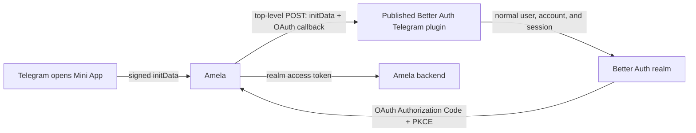

# Telegram Mini App Authentication

Status: auth platform and SDK implemented and verified; Amela rollout in progress
Last updated: 2026-07-22

This is the source of truth for Telegram login in Amela.

## Decision

Telegram is an optional integration enabled separately for each realm. It is
not a global social-login button and it is not implemented by Amela itself.

We use the published Better Auth plugin:

```text
@nezdemkovski/best-auth-telegram@1.5.3
```

We do not maintain a second Telegram verifier or a private workspace plugin.
The auth platform only stores the realm's bot configuration and composes the
published plugin into that realm's Better Auth runtime.

```text
No connection row       -> no Telegram plugin in the realm
Connection row exists   -> Mini App plugin enabled in the realm
```

There is no separate `enabled` flag and no `realm.slug === "amela"` branch.

## Architecture



The published plugin owns:

- parsing and HMAC validation of Telegram `initData` with the bot token;
- freshness validation and Better Auth endpoint rate-limit rules;
- creating or reusing the Telegram account and Better Auth user;
- creating the normal Better Auth realm session cookie;
- the Mini App sign-in and validation endpoints.

The auth platform owns:

- an encrypted bot token and bot username for each connected realm;
- adding the plugin only to connected realm runtimes;
- Better Auth schema migration before enabling the plugin;
- atomic runtime replacement with persistence rollback on failure;
- authenticated admin connect, read, and disconnect operations.

Amela owns only the product-side bootstrap: read `Telegram.WebApp.initData`
and call one SDK method. The SDK prepares the ordinary OAuth PKCE transaction,
submits a top-level form to the realm plugin, and the plugin redirects to that
OAuth authorization URL after Better Auth creates the session.

The Amela backend remains a normal OAuth resource server. It never validates
Telegram launch data and never issues a parallel application token.

## Backend layout

```text
apps/api/src/modules/telegram-mini-app/
  better-auth.ts   published plugin composition
  core.ts          connect/disconnect lifecycle and rollback
  http.ts          admin HTTP boundary
  store.ts         encrypted realm configuration
  validator.ts     admin input validation
  translator.ts    secret-free admin response
  __tests__/
```

The reusable authentication implementation stays in the npm dependency. This
module is only the platform adapter needed by our multi-realm service.

## Stored configuration

The admin realm owns one optional row per product realm:

```text
auth_telegram_mini_app_connections
  project_slug      primary key, realm reference
  bot_username      non-secret Telegram bot username
  bot_token_cipher  AES-GCM encrypted bot token
  created_at
  updated_at
```

The bot token is required because Telegram Mini App HMAC verification is bound
to the bot that launched the app. It is encrypted with the platform settings
key and a realm-specific encryption context. It is never returned by the admin
API, written to audit logs, exposed to Amela, or included in browser code.

## Admin API

Read:

```text
GET /admin/api/projects/:slug/integrations/telegram-mini-app
```

Connect or replace credentials:

```text
PUT /admin/api/projects/:slug/integrations/telegram-mini-app
```

```json
{
  "botUsername": "amela_bot",
  "botToken": "<token from BotFather>"
}
```

Disconnect:

```text
DELETE /admin/api/projects/:slug/integrations/telegram-mini-app
```

Connect performs these steps in order:

1. validate admin access, mutable realm, username, and token;
2. encrypt and persist the configuration;
3. add the configuration to the in-memory realm catalog;
4. run Better Auth schema migration with the Telegram plugin present;
5. rebuild only the selected realm runtime.

If migration or runtime initialization fails, persistence and the runtime
catalog are restored to the previous connection. Schema additions are safe to
leave in place because they contain no credentials and Better Auth can reuse
them on a later attempt.

Disconnect removes the plugin for future requests. It deliberately does not
delete existing users, accounts, sessions, or Amela product data.

## Better Auth runtime

For a connected realm the platform contributes:

```ts
telegram({
  botToken,
  botUsername,
  loginWidget: false,
  maxAuthAge: 300,
  miniApp: {
    enabled: true,
    validateInitData: true,
    allowAutoSignin: true
  }
});
```

Telegram OIDC is not enabled by this integration. The ordinary Login Widget is
also disabled. Only the Mini App endpoints are added.

Telegram does not provide an email address. New users receive a deterministic
non-deliverable address in the reserved `.invalid` domain while
`emailVerified` remains false. Telegram's numeric user id is still the stable
provider account id.

The sign-in endpoint is:

```text
POST /api/:realm/auth/telegram/miniapp/signin
Content-Type: application/x-www-form-urlencoded

initData=<raw Telegram initData>
callbackURL=<trusted realm OAuth authorization URL>
```

It sets the normal Better Auth realm session cookie and redirects to the
trusted OAuth authorization URL. A top-level navigation is intentional: it
does not depend on third-party cookies inside Telegram's embedded browser.
Both the source origin and callback must belong to the realm's Better Auth
trusted origins. JSON requests without a callback remain supported by the
plugin. When the realm is disconnected, Better Auth has no matching endpoint
and returns `404`.

## Admin experience

The UI exposes one understandable card, not OAuth terminology:

```text
Telegram
Automatically sign people in when this app is opened from Telegram.

[ Connect ]
```

Connect asks for exactly two BotFather values:

- Bot username
- Bot token

Connected state shows the username and a Disconnect action. It must not show
OIDC, client ids, redirect URIs, scopes, resources, consent, profiles, or a
second enable switch.

## Amela rollout

1. Inspect whether the Amela realm already has successful legacy Telegram OIDC
   accounts and define an explicit migration if it does.
2. Connect the Amela bot to the Amela realm through the admin API/UI.
3. On Mini App startup, pass non-empty `Telegram.WebApp.initData` once to
   `auth.signInWithTelegramMiniApp(...)`.
4. Let the SDK and plugin continue the existing OAuth Authorization Code with
   PKCE flow after the realm session exists.
5. Remove the hosted `Continue with Telegram` button from Amela.
6. Verify the full flow in current Telegram clients on iOS and Android.

## Remaining security follow-up

- Never log or persist raw `initData`.
- The integration suite covers the five-minute credential-age limit, invalid
  bot signatures, realm isolation, trusted-origin CORS preflight, URL-encoded
  browser handoff, redirect behavior, and rejection of an untrusted origin.
- Published plugin `1.5.3` rejects credentials too far in the future as well as
  expired credentials.
- Decide whether single-use replay protection is necessary after threat
  modeling the real Mini App flow; the current plugin uses freshness and rate
  limits but has no shared one-time replay store.
- Keep Telegram credentials out of all admin responses and audit events.

## Rollout order

- [x] Depend on the published Better Auth Telegram plugin.
- [x] Add encrypted realm-scoped connection persistence.
- [x] Compose the plugin only for connected realms.
- [x] Migrate Better Auth schema before runtime activation.
- [x] Add admin read/connect/disconnect endpoints.
- [x] Add lifecycle rollback and secret-boundary tests.
- [x] Add and visually verify the minimal admin UI card.
- [x] Verify connect, signed Mini App sign-in, realm isolation, and disconnect
      against the real Better Auth runtime and Postgres.
- [x] Add the browser SDK Mini App bootstrap without third-party-cookie
      dependence.
- [ ] Publish the plugin and SDK, connect the Amela realm, and deploy Amela.
- [ ] Run real iOS and Android end-to-end verification.
- [ ] Remove legacy Telegram OIDC configuration and hosted-login UI after the
      new flow is proven.

## References

- [Telegram Mini App validation](https://core.telegram.org/bots/webapps#validating-data-received-via-the-mini-app)
- [Better Auth plugins](https://better-auth.com/docs/concepts/plugins)
- [`@nezdemkovski/best-auth-telegram`](https://www.npmjs.com/package/@nezdemkovski/best-auth-telegram)
